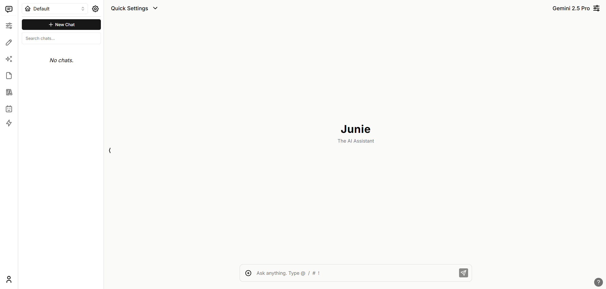

# Junie

Your personal AI assistant.



## About

Junie is a powerful AI chat application built with Next.js 14, TypeScript, Supabase, and Tailwind CSS. It features multi-LLM support, file attachments, assistants, tools, and workspaces.

## Features

- 🤖 **Multi-LLM Support** - OpenAI, Anthropic, Google, Azure, Mistral, Groq, OpenRouter, Ollama
- 📁 **File Processing** - PDF, DOCX, TXT, CSV, JSON, Markdown support
- 🖼️ **Image Attachments** - Vision model support
- 🔧 **Custom Tools** - Extensible tool system
- 👥 **Assistants** - Pre-configured AI assistants
- 🗂️ **Workspaces** - Organize your conversations and files
- 🌍 **Multi-language** - i18n support
- 🎨 **Dark Mode** - Beautiful, modern UI

## Local Quickstart

Follow these steps to get Junie running locally.

### 1. Clone the Repo

```bash
git clone <your-repo-url>
cd junie
```

### 2. Install Dependencies

```bash
npm install
```

### 3. Install Docker

You will need Docker to run Supabase locally. Download it [here](https://docs.docker.com/get-docker).

### 4. Install Supabase CLI

**MacOS/Linux**

```bash
brew install supabase/tap/supabase
```

**Windows**

```bash
scoop bucket add supabase https://github.com/supabase/scoop-bucket.git
scoop install supabase
```

### 5. Start Supabase

```bash
supabase start
```

### 6. Fill in Secrets

#### Environment Variables

```bash
cp .env.local.example .env.local
```

Get the required values by running:

```bash
supabase status
```

Note: Use `API URL` from `supabase status` for `NEXT_PUBLIC_SUPABASE_URL`

Fill in your `.env.local` file with the values from `supabase status`.

#### SQL Setup

In the migration file `supabase/migrations/20240108234540_setup.sql`, replace:

- `project_url` (line 53): `http://supabase_kong_chatbotui:8000` (default)
- `service_role_key` (line 54): Value from `supabase status`

### 7. Install Ollama (Optional)

For local AI models, follow instructions at [https://github.com/jmorganca/ollama](https://github.com/jmorganca/ollama).

### 8. Run the App

```bash
npm run chat
```

Junie should now be running at [http://localhost:3000](http://localhost:3000).

View your backend GUI at [http://localhost:54323/project/default/editor](http://localhost:54323/project/default/editor).

## Updating

To update to the latest version:

```bash
npm run update
```

For hosted instances, also run:

```bash
npm run db-push
```

## Development Commands

- `npm run dev` - Start development server
- `npm run build` - Build for production
- `npm run lint` - Lint code
- `npm run lint:fix` - Fix linting errors
- `npm run format:write` - Format code with Prettier
- `npm run type-check` - Run TypeScript type checking
- `npm run clean` - Lint and format all code
- `npm run db-reset` - Reset database (⚠️ deletes all data)
- `npm run db-migrate` - Run migrations
- `npm run db-types` - Generate TypeScript types from database

## Tech Stack

- **Frontend**: Next.js 14 (App Router), React 18, TypeScript
- **Styling**: Tailwind CSS, shadcn/ui components
- **Database**: Supabase (PostgreSQL)
- **Auth**: Supabase Auth
- **AI**: OpenAI, Anthropic, Google, and more via various SDKs
- **State Management**: React Context
- **Icons**: Tabler Icons

## Project Structure

```
/app          - Next.js 14 App Router pages and API routes
/components   - React components organized by feature
/db           - Database access functions
/lib          - Utility functions and business logic
/types        - TypeScript type definitions
/supabase     - Database migrations and generated types
/context      - React Context for global state
/public       - Static assets
```

## Credits

Originally forked from [Chatbot UI](https://github.com/mckaywrigley/chatbot-ui) by McKay Wrigley.

## License

MIT
